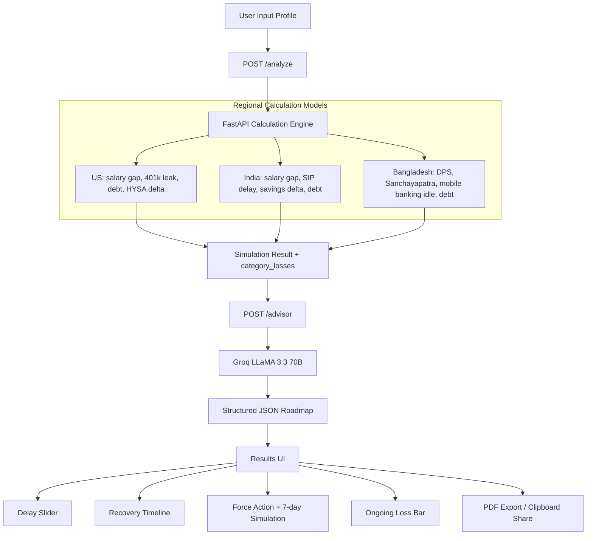

# WillSpend

Opportunity cost is not theoretical. WillSpend measures what inaction is already costing you per day.

[](https://willspend.vercel.app)
[](https://willspend.vercel.app)
[](https://willspend.onrender.com)
[](https://www.python.org/)
[](https://react.dev/)
[](https://groq.com/)
[](LICENSE)

## Overview

WillSpend is a Financial Inaction Engine for first-job earners in the US, India, and Bangladesh.

Most finance apps estimate future gains. WillSpend quantifies opportunity cost already lost and turns that into an immediate action path.

Core stack:

- Frontend: React 18, Vite, TypeScript, Framer Motion
- Backend: FastAPI (Python), deployed on Render
- AI advisory: Groq LLaMA 3.3 70B with structured JSON roadmap output
- Deployment: Vercel (frontend) + Render (backend)

## How It Works

1. User enters profile and financial behavior inputs.
2. Frontend posts to `POST /analyze` for country-specific inaction simulation.
3. Backend computes category losses (salary, savings, investing, debt, regional products).
4. Frontend posts to `POST /advisor` with `category_losses`; Groq returns structured roadmap JSON.
5. UI renders urgency + action sequence: recovery simulation, force-action steps, and export/share.

## Screenshots

Replace these placeholders with real images/GIFs.

- [screenshot: hero + opening sequence]
- [screenshot: live loss ticker + profile form]
- [screenshot: results dashboard + inaction age score]
- [screenshot: force action system + 7-day simulation]
- [screenshot: delay slider + recovery chart]
- [screenshot: PDF export + share flow]

## Features

### Discovery
| Feature | What It Does | Why It Matters |
|---|---|---|
| Full-screen opening sequence | 3.5s takeover before hero | Creates immediate context and urgency |
| Live Loss Ticker | Hero ticker synced from opening sequence | Visualizes compounding loss in motion |
| Financial Inaction Engine badge | Context anchor in hero/results flow | Frames model intent clearly |

### Calculator
| Feature | What It Does | Why It Matters |
|---|---|---|
| Multi-region loss engine | US, India, Bangladesh calculations | Keeps assumptions region-appropriate |
| Live loss preview | Recalculates during form input | Fast feedback loop before submit |

### Results and Insights
| Feature | What It Does | Why It Matters |
|---|---|---|
| Inaction Age Score | Converts loss to years of delay | Makes cost legible beyond currency |
| What-If Delay Slider | 0-5 year delay, real-time compound recalc | Shows the price of postponement |
| Recovery Timeline Chart | Do Nothing vs Follow the Plan | Makes intervention impact obvious |
| Peer Comparison | Age + country median context | Adds grounded social benchmark |
| Trust anchors | Source/rate/model context labels | Defends credibility under scrutiny |

### Action Layer
| Feature | What It Does | Why It Matters |
|---|---|---|
| Force Action System | 3 auto-generated steps from top loss categories | Reduces decision overhead |
| 7-day Action Simulation Engine | Animated recovery projection | Previews short-term payoff |
| Commitment flow | One-click commit with immediate feedback | Converts insight into action |
| Ongoing Loss Bar | Persistent bottom bar in results | Keeps cost-of-delay visible |

### AI
| Feature | What It Does | Why It Matters |
|---|---|---|
| Groq LLaMA 3.3 70B advisor | Uses computed loss context, not generic prompts | Keeps advice data-anchored |
| Structured roadmap output | JSON parsed into UI action cards | Deterministic frontend rendering |
| Region-aware recommendations | 401k, SIP, DPS, Sanchayapatra, HYSA contexts | Avoids non-local advice |

### Export and Share
| Feature | What It Does | Why It Matters |
|---|---|---|
| One-click PDF export | Generates report from current analysis | Portable artifact for users/reviewers |
| Clipboard share | Copies summary payload | Enables quick social loop |

## API Surface

- `POST /analyze` -> regional calculation engine (US/India/Bangladesh)
- `POST /advisor` -> Groq-grounded advisory with `category_losses`
- `POST /generate_report` -> PDF generation
- `POST /validate_recovery` -> recovery validation stub
- `GET /health` -> service health + provider/cache metadata
- `GET /ping` -> warm-up endpoint

## Architecture

### System Flow: Inaction Signal -> Simulation -> AI Plan -> Action



## Environment Variables

### Frontend (`/frontend`)

| Variable | Required | Example | Purpose |
|---|---|---|---|
| `VITE_API_URL` | Yes | `https://willspend.onrender.com` | Backend base URL for API calls |

### Backend (`/backend`)

| Variable | Required | Example | Purpose |
|---|---|---|---|
| `GROQ_API_KEY` | Yes | `gsk_...` | Auth for Groq LLaMA 3.3 70B advisor |

## Quick Start (Monorepo)

### 1) Clone

```bash
git clone https://github.com/<your-org>/WillSpend.git
cd WillSpend
```

### 2) Backend (`/backend`)

```bash
cd backend
python -m venv .venv
# Windows PowerShell
.venv\Scripts\Activate.ps1
# macOS/Linux
# source .venv/bin/activate

pip install -r ../requirements.txt
uvicorn main:app --reload --port 8000
```

### 3) Frontend (`/frontend`)

```bash
cd ../frontend
npm install
```

Create `.env` in `/frontend`:

```bash
VITE_API_URL=https://willspend.onrender.com
```

Then run:

```bash
npm run dev
```

## Deployment

- Frontend: Vercel -> `https://willspend.vercel.app`
- Backend: Render -> `https://willspend.onrender.com`

Recommended Vercel settings:

- Root directory: `frontend`
- Framework: Vite
- Build command: `npm run build`
- Output directory: `dist`
- Env var: `VITE_API_URL=https://willspend.onrender.com`

## Repository Layout

```text
WillSpend/
├─ backend/
│  ├─ main.py
│  ├─ calculator.py
│  ├─ ai_advisor.py
│  ├─ ai_client.py
│  ├─ models.py
│  └─ ...
├─ frontend/
│  ├─ src/
│  │  ├─ components/
│  │  ├─ api/client.ts
│  │  └─ ...
│  ├─ package.json
│  └─ ...
├─ requirements.txt
└─ README.md
```

## Roadmap

- [ ] UK mode (ISA gap + pension contribution model)
- [ ] Mobile-first Bangladesh flow (offline DPS calculator)
- [ ] Anonymous aggregate benchmark dataset by country
- [ ] Reliability telemetry for advisor and PDF generation latency
- [ ] End-to-end test coverage for simulation + advisor contract

## Contributing

Contributions are welcome.

1. Fork the repo.
2. Create a feature branch: `git checkout -b feat/your-change`.
3. Keep changes scoped and add tests where possible.
4. Run checks from `/frontend` and `/backend` before opening PR.
5. Open a PR with a concise problem statement and before/after behavior.

Please use issues for bug reports and feature proposals before large refactors.

## License

Licensed under the MIT License. See [LICENSE](LICENSE).
