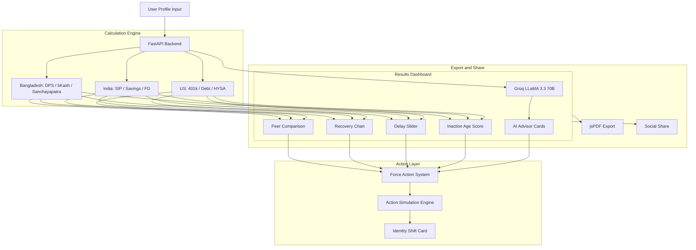

# WillSpend 💸

WillSpend forces you to confront the exact daily cost of your financial inaction.

## LIVE DEMO
`https://willspend.app`
Start here: land on the hero, watch the ticker, fill the form, drag the delay slider.

## WHY THIS EXISTS
Most personal finance tools calculate Future Value to show you what you can gain. We calculate the opportunity cost you have already lost. The psychological weight of money lost to indecision drives immediate corrective behavior.

## WHAT IT DOES: FEATURE TABLE

### Discovery
| Feature | What It Does | Why It Matters |
|---|---|---|
| Full-screen opening sequence | 3.5 second takeover before hero | Establishes immediate authority before the user can navigate away |
| Live Loss Ticker | Hero ticker synced from opening sequence | Visualizes the pace of capital loss |
| Financial Inaction Engine badge | Contextual tagging | Sets technical expectations |

### Calculator
| Feature | What It Does | Why It Matters |
|---|---|---|
| Multi-country inaction calculator | Handles US, India, Bangladesh (with Sanchayapatra) | Localizes financial vectors |
| Live loss preview | Updates while filling form | Creates immediate feedback loop |

### Results and Insights
| Feature | What It Does | Why It Matters |
|---|---|---|
| Inaction Age Score | Years of wealth building lost | Translates money into lost time |
| What If Delay Slider | 0 to 5 years, real-time compound update | Simulates the exact penalty of future hesitation |
| Recovery Timeline Chart | Do Nothing vs Follow the Plan, 12 months | Visualizes the delta of taking action |
| Peer Comparison Chart | Compares user vs median for age and country | Activates social pressure |
| Credibility anchors | Rates, sources, model disclaimer | Defends the math against skepticism |

### Action Layer
| Feature | What It Does | Why It Matters |
|---|---|---|
| Force Action System | 3 auto-generated steps from top loss categories | Reduces cognitive load |
| Action Simulation Engine | 7-day toggle, animated recovery | Previews the reward of execution |
| Identity Shift final state | "You have stopped the financial loss cycle" | Closes the psychological loop |
| Ongoing Loss Bar | Persistent fixed bar, never disappears | Tracks the exact cost of abandoning the results tab |

### AI
| Feature | What It Does | Why It Matters |
|---|---|---|
| Groq LLaMA 3.3 70B advisor | Grounded in specific calculated losses | Prevents generic financial advice |
| Structured JSON roadmap | Parsed into step cards with Framer Motion stagger | Returns structured, actionable engineering tasks |
| Country-specific product recommendations | DPS, Sanchayapatra, SIP, HYSA, 401k | Limits advice to strictly relevant local vehicles |

### Export and Share
| Feature | What It Does | Why It Matters |
|---|---|---|
| jsPDF full report export | Generates formatted PDF locally | Portable artifact for offline reference |
| One-click clipboard share | Copies aggregate stats | Triggers viral social loops |

## ARCHITECTURE



## COUNTRY SUPPORT TABLE

| Feature | Bangladesh | India | US |
|---|---|---|---|
| Currency | ৳ | ₹ | $ |
| Savings vehicle | bKash / Nagad | Savings account | HYSA |
| Investment product | DPS / DSE | SIP / Nifty 50 | S&P 500 |
| Debt comparison | Personal vs Secured | Personal | Personal |
| Unique calculation | Sanchayapatra | FD rates | 401k match |
| AI localization reference points | Dhaka rent | Groceries for 4 | 3 months emergency fund |

## QUICK START

### Backend
```bash
cd backend
python -m venv venv
source venv/Scripts/activate
pip install -r requirements.txt
uvicorn main:app --reload
```

### Frontend
```bash
cd frontend
npm install
npm run dev
```

## HOW THE AI ADVISOR WORKS
The FastAPI backend receives the precise category losses computed by the regional calculation engines. This loss dictionary is formatted and injected into the Groq system prompt, anchoring the Large Language Model to the specific user telemetry. The temperature is strictly controlled. The model is commanded to emit a strictly structured JSON roadmap, ensuring deterministic parsing on the frontend. A fallback retry loop guarantees a valid JSON schema is caught and passed to the React layer, while strict exclusionary language rules block any passive advisory phrasing.

## BUILT FOR
Global Fusion Hackathon 2026, FinTech and AI track, fulfilling the mandate to provide scalable logic that works across distinct global regulatory frameworks.

## WHAT IS NEXT
1. UK mode with ISA gap and pension contribution calculator
2. Mobile app for Bangladesh with offline DPS calculator and bKash deep link integration
3. Anonymous aggregate data showing real median inaction costs per country from actual user sessions
